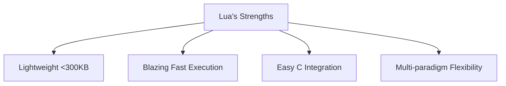

# 🌙 Introduction to Lua

Welcome to LuaOrbiter - your launchpad into Lua programming! This versatile language powers everything from game AI to web servers. Let's explore why it's beloved by developers worldwide.



## 🚀 Why Choose Lua?
- **Embeddable**: Integrates seamlessly with C/C++/Python
- **Portable**: Runs on any platform with ANSI C compiler
- **Simple**: Minimal syntax with powerful capabilities
- **Efficient**: Register-based VM with GC optimization

### Real-World Applications
| **Domain**       | **Examples**                     |
|------------------|----------------------------------|
| 🎮 Game Dev      | Roblox, WoW, LÖVE2D             |
| 🌐 Web Servers   | NGINX/OpenResty, Kong Gateway   |
| 🔌 Embedded      | IoT devices, industrial systems |
| 🤖 AI/ML         | Hybrid scripting layer           |
| 🛠 Dev Tools     | Neovim, Redis, Wireshark        |

---

## ⚡ First Contact with Lua

### Interactive Mode (REPL)
```bash
> lua -i  # Launch interpreter
Lua 5.4.8  Copyright (C) 1994-2025 Lua.org, PUC-Rio
> print("Moonscript: " .. _VERSION)
Moonscript: Lua 5.4
> 5 + math.pi * 2  # Immediate math
11.28318530718
```

### Script Execution
1. Create `hello.lua`:
```lua
-- First program
io.write("Hello from ", _VERSION, "!\n")
```
2. Run:
```bash
$ lua hello.lua
Hello from Lua 5.4!
```

### Shell-Specific Tips
| Shell       | Command Format                          |
|-------------|-----------------------------------------|
| **CMD**     | `lua -e "io.write('Hello!')"`           |
| **PowerShell** | `lua -e "io.write('Hello!')"`        |
| **Bash**    | `lua -e 'io.write("Hello!")'`           |

> 💡 Pro Tip: Use `lua -v` to verify installation. Add `#!/usr/bin/env lua` to make scripts executable.

---

## 🔠 Lua Syntax Fundamentals

### Building Blocks (Tokens)
```lua
score = 100  -- Tokens: [identifier] [operator] [number]
```
- **Keywords**: `if`, `function`, `local` (reserved words)
- **Identifiers**: `playerHealth`, `calculate_score`
- **Literals**: `"text"`, `3.14`, `true`
- **Operators**: `+`, `..`, `==`
- **Delimiters**: `()`, `{}`, `[]`

### Naming Rules
```lua
local max_speed = 100  -- Valid
local 3d_position = nil  -- INVALID (starts with number)
```
- Start with letter/underscore
- Contain letters, numbers, underscores
- Case-sensitive (`Score ≠ score`)
- Avoid reserved words

### Comments
```lua
-- Single-line comment

--[[
  Multi-line comment
  Preserves formatting
--]]

--[=[
  Nested [[comments]] work too!
]=]
```

### Reserved Keywords
|          |         |         |         |
|----------|---------|---------|---------|
| `and`    | `break` | `do`    | `else`  |
| `false`  | `for`   | `function`| `if`  |
| `nil`    | `not`   | `or`    | `return`|
| `true`   | `while` | `local` | `end`   |

---

## ✨ What Makes Lua Unique?
1. **Tables**: Single data structure for arrays/dictionaries/objects
2. **1-based indexing**: First element at position 1
3. **Metatables**: Customize type behaviors
4. **Coroutines**: Cooperative multitasking
5. **Tail Calls**: Optimized recursion

### Lua vs. Other Languages
| **Feature**       | Lua       | Python     | JavaScript |
|-------------------|-----------|------------|------------|
| Embedding         | ★★★★★     | ★★☆☆☆      | ★☆☆☆☆      |
| Startup Time      | Instant   | Moderate   | Fast       |
| Memory Footprint  | ~300KB    | ~25MB      | ~10MB      |
| Learning Curve    | Gentle    | Moderate   | Steep      |
| Game Modding      | Industry Standard | Limited | Browser-based |

---

## ✅ Lesson Checklist
- [ ] Ran code in interactive mode
- [ ] Executed a Lua script file
- [ ] Identified basic tokens
- [ ] Used valid identifiers
- [ ] Marked complete in [Progress Tracker](./02-beginner-checklist.md)

> "Lua is the Swiss Army knife of scripting - small enough to fit anywhere, powerful enough to solve complex problems."  
> – Game Developer, AAA Studio

📜 **License**: MIT-like (free for all uses)  
🌐 **Official Site**: [lua.org](https://www.lua.org)
