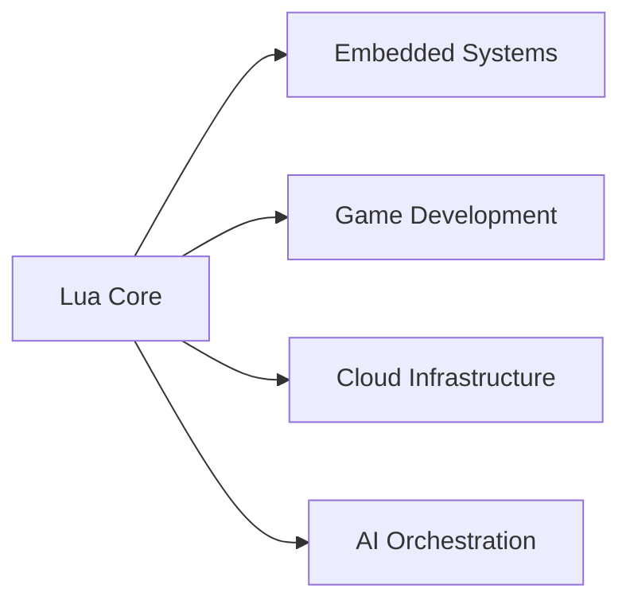
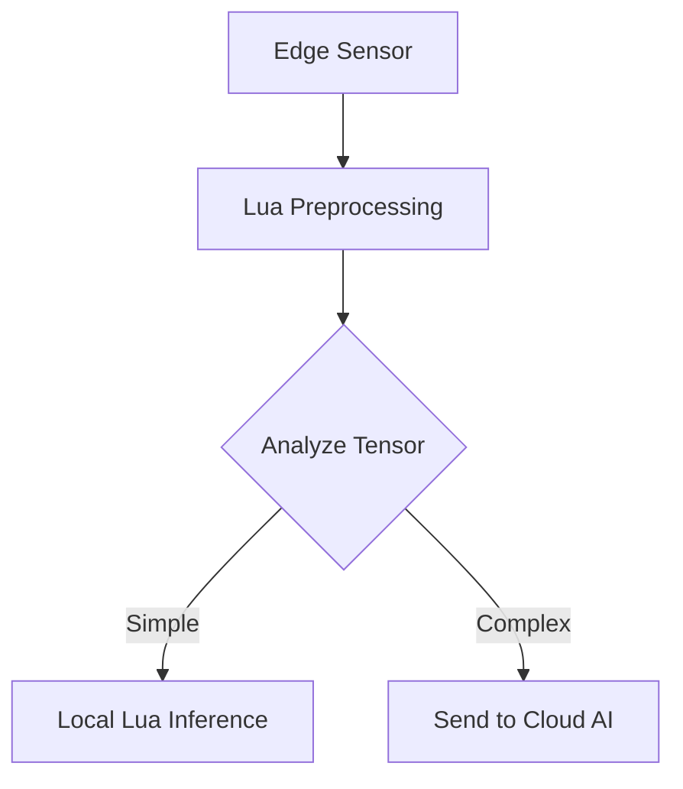

# 🌐 Lua Ecosystem Overview: Powering Lightweight Innovation

Welcome to the Lua universe — a minimalist language with outsized impact. From game engines to cloud infra, Lua runs virtually anywhere.

---

## 🧠 Core Philosophy

Lua is built around **three guiding principles**:

1. **Embeddability** – Simple C API for easy integration  
2. **Portability** – Compiles and runs anywhere (120KB binary!)  
3. **Extensibility** – Small core + big ecosystem via optional libraries



> 💡 Lua's minimal runtime makes it ideal for scripting inside larger applications.

---

## 🚀 Core Components

### ⚙️ Language Implementations

| Implementation                                   | Highlights                  | Best For                  |
| ------------------------------------------------ | --------------------------- | ------------------------- |
| [PUC Lua](https://www.lua.org/)                  | Official ANSI C interpreter | Embedded, education       |
| [LuaJIT](https://luajit.org/)                    | Just-in-Time compiler, FFI  | Performance-critical apps |
| [Ravi](https://github.com/dibyendumajumdar/ravi) | Optional static typing      | Scientific computing      |
| [Fengari](https://fengari.io/)                   | Lua for WebAssembly (WASM)  | Browser scripting         |

### 📦 Package Management

* [LuaRocks](https://luarocks.org/) Official package manager (3,800+ modules)
  
  ```bash
  luarocks install packagename
  ```

* **Alternatives**:
  
  * [LuaDist](https://luadist.org/) – Binary distribution system
  * [Lit](https://luvit.io/lit.html)  For Luvit ecosystem

---

## 🌟 Domain-Specific Ecosystems

### 🎮 Game Development

| Engine                          | Highlights                   | Used In                  |
| ------------------------------- | ---------------------------- | ------------------------ |
| [LÖVE](https://love2d.org/)     | Simple 2D game framework     | Indie games, prototypes  |
| [Defold](https://defold.com/)   | Full-featured engine by King | Bubble Galaxy, Tacticool |
| [Solar2D](https://solar2d.com/) | Mobile-first (ex-Corona)     | Over 500M+ app installs  |

**Popular Lua Game Libraries**:

* `bump.lua` – Collision detection
* `HUMP` – Game helpers (camera, classes)
* `STI` – Tile map loader

---

### ☁️ Web & Cloud

| Framework                            | Stack          | Throughput        |
| ------------------------------------ | -------------- | ----------------- |
| [OpenResty](https://openresty.org/)  | LuaJIT + Nginx | \~50K rps/core    |
| [Lapis](https://leafo.net/lapis/)    | MVC framework  | Fast, lightweight |
| [Sailor](https://sailorproject.org/) | ORM + Auth     | Full-stack option |

**Networking Example**:

```lua
local http = require "resty.http"
local client = http.new()
client:connect("api.example.com", 443)
client:ssl_handshake()
client:request({ path = "/data" })
```

---

### 🤖 AI & Machine Learning

| Tool                                               | Role                      | Integration Type        |
| -------------------------------------------------- | ------------------------- | ----------------------- |
| [Torch7](https://pytorch.org/)                     | Original Lua-based ML lib | Tensor ops, GPU support |
| [Lunatic-Python](https://labix.org/lunatic-python) | Lua ↔ Python bridge       | PyTorch compatibility   |
| [LuaNN](https://github.com/torch/nn)               | Lightweight neural nets   | Pure Lua implementation |



---

### 🔌 Embedded & IoT

| Platform                                   | Hardware Focus        | RAM Footprint |
| ------------------------------------------ | --------------------- | ------------- |
| [eLua](https://www.eluaproject.net/)       | Microcontrollers      | \~50KB        |
| [NodeMCU](https://nodemcu.readthedocs.io/) | ESP8266/ESP32 boards  | \~200KB       |
| [Terra](https://terralang.org/)            | Low-level Lua variant | Systems-level |

**Real-World Deployments**:

* Cisco – Router scripting
* Philips Hue – Lighting control
* Tesla – Touchscreen UI logic

---

## 🛠 Developer Tooling

### 🔍 IDEs & Extensions

| Tool                                                                                | Features               | Platform       |
| ----------------------------------------------------------------------------------- | ---------------------- | -------------- |
| VSCode + [Lua LSP](https://marketplace.visualstudio.com/items?itemName=sumneko.lua) | Autocomplete, debugger | Cross-platform |
| [ZeroBrane Studio](https://studio.zerobrane.com/)                                   | Lua-focused IDE        | All major OS   |
| [EmmyLua for IntelliJ](https://github.com/EmmyLua/IntelliJ-EmmyLua)                 | Java IDE integration   | JetBrains IDEs |

### 🔧 Command Line Utilities

* `busted` – Unit testing (BDD style)
* `luassert` – Enhanced assertions
* `luacheck` – Static code analysis
* `styLua` – Formatter powered by Rust
* `mobdebug` – Remote debugger

---

## 📊 Industry Impact

### 🏢 Notable Users

| Company    | Use Case            | Scale                 |
| ---------- | ------------------- | --------------------- |
| Roblox     | Game scripting      | 200M+ users           |
| Cloudflare | Edge workers        | 25% of global traffic |
| Redis      | Lua scripting in DB | 1M+ deployments       |
| Blizzard   | WoW Add-ons         | 120M+ installs        |
| Adobe      | Lightroom plugins   | Creative Cloud users  |

### 💰 Economic Footprint

* 🎮 \$20B+ in Lua-powered game revenue (2023)
* 💼 45% YoY growth in Lua developer job postings
* 🖥️ \~70% lower compute cost (vs Python) for edge scripting

---

## 🌱 Learning & Community

### 📚 Resources

* [Lua Users Wiki](http://lua-users.org/wiki/) – Community-driven knowledge base
* [Awesome Lua](https://github.com/LewisJEllis/awesome-lua) – Curated Lua tools
* [Lua Workshop](https://www.lua.org/events.html) – Official annual conference

### 🚀 Trends to Watch

1. **WebAssembly** – Run Lua in the browser with Fengari
2. **AI Orchestration** – Lua bridging Python/C++ ML code
3. **Blockchain** – Lua scripting in Solana/SeaLevel VMs
4. **Quantum Research** – Lua-based control in experimental labs

> 🧠 *“Lua proves elegance and power aren't mutually exclusive. It’s the secret sauce behind embedded innovation and scalable software.”*
> — **Dr. Roberto Ierusalimschy**, Creator of Lua

---
