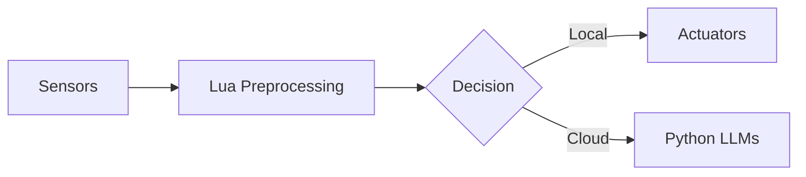

# 🚀 Getting Started with Lua

<p align="center">
  
</p>

---

## 🧩 What is Lua?

**Lua** is a lightweight, high-performance scripting language designed for embedding into other applications. Known for its simplicity, speed, and small footprint, Lua is used in everything from **game engines** to **AI systems**, **IoT devices**, and **cloud platforms**.

Developed in Brazil and adopted globally, Lua powers technologies behind **Roblox**, **NGINX**, **Redis**, and many more.

---

## 📖 What You’ll Learn

This course follows a **project-driven learning path**, progressing from basic syntax to high-performance and embedded Lua systems. You'll build real-world projects across:

- 🎮 Game development  
- 🔌 Embedded scripting  
- 🤖 AI automation  
- 🛠 Developer tooling  

Whether you're just starting out or looking to integrate Lua into your tech stack, this roadmap equips you with practical, production-ready skills.

---

## 🌟 Why Learn Lua in 2025?

### Fast. Lightweight. Everywhere.

- 🎮 **Game Development**: Lua powers AI, UI, and gameplay scripting in titles like Roblox, WoW, and Love2D.  
  → *Used in over 70% of commercial game engines.*

- ⚡ **Embedded & Edge AI**: Lua runs efficiently on constrained devices like microcontrollers and gateways.  
  → *Popular in Redis, NGINX, and OpenResty.*

- 🤖 **Hybrid AI Orchestration**: Lua bridges LLMs, C++, and Python in modern AI pipelines.

- 💼 **Career Boost**: In demand for **AI systems**, **embedded scripting**, and **game modding**.

---

## 🤖 Real-World AI Integration

### 🎮 Game AI Example (Roblox-style)

```lua
function enemy:update()
  local threat = aiPredictThreat(player)
  if threat > 0.7 then
    self:retreat()
  else
    self:attack()
  end
end
````

> Lua handles decision logic, while an ML model scores threat level.

---

### 🌐 Edge AI Orchestration



> Lua acts as an inference manager, bridging embedded devices and cloud AI.

---

## 📚 Skill Progression

👶 **Beginner** → 👨‍💻 **Intermediate** → 👨‍🏫 **Advanced** → 🧠 **Expert** → 💼 **Professional**

Each stage builds on real project outcomes.

---

### 👶 Beginner: Core Foundations

**🎯 Goal:** Write clean scripts using Lua fundamentals.

```lua
function c_to_f(c)
  return (c * 9 / 5) + 32
end
print(c_to_f(25)) -- Output: 77
```

**Topics:**

* Variables, conditionals, loops
* Functions and table operations
* Standard libraries: `math`, `string`, `io`
* Basic debugging & file I/O

**Mini Projects:**

* Rock-paper-scissors AI
* Text-based adventure
* Inventory system
* File renamer
* Basic Roblox mod

---

### 👨‍💻 Intermediate: Modular Systems

**🎯 Goal:** Build structured, reusable Lua code.

```lua
Character = {health = 100}
function Character:new(o)
  return setmetatable(o or {}, {__index = self})
end
```

**Topics:**

* Metatables and OOP patterns
* Coroutines and async logic
* JSON serialization
* Error handling with `pcall` / `xpcall`
* Module systems

**Projects:**

* API client
* Dialogue engine
* Plugin loader
* Game AI state machine
* Config management system

---

### 👨‍🏫 Advanced: C Integration & Optimization

**🎯 Goal:** Interface with C/C++ and optimize runtime performance.

```c
int lua_add(lua_State *L) {
  int a = lua_tonumber(L, 1);
  int b = lua_tonumber(L, 2);
  lua_pushnumber(L, a + b);
  return 1;
}
```

**Topics:**

* Lua C API
* LuaJIT and FFI
* Performance profiling
* Memory tuning and GC control

**Projects:**

* Embedded Lua for Redis
* Game bot with predictive AI
* LuaJIT image processor
* Real-time emotion detector

---

### 🧠 Expert: Systems-Level Lua

**🎯 Goal:** Dive into Lua internals and systems architecture.

**Topics:**

* Bytecode generation
* Lua VM internals
* Sandboxing and secure execution
* Distributed scripting via OpenResty
* Transpiler and DSL development

**Projects:**

* Lua→WASM transpiler
* Lua-based Kubernetes API proxy
* AI-powered game engine controller
* Embedded firmware orchestrator

---

## 💼 Career Tracks with Lua

| Domain       | Tech Stack               | Entry Point         | Growth Path                 |
| ------------ | ------------------------ | ------------------- | --------------------------- |
| 🎮 Game Dev  | Lua + C++ / Roblox       | Modding & scripting | Gameplay Dev → AI Engineer  |
| 🌐 Web/Cloud | OpenResty + K8s + LuaJIT | API scripting       | Backend Dev → Cloud Lead    |
| 🔌 Embedded  | Lua + RTOS + C           | IoT & firmware      | Embedded Dev → Systems Lead |
| 🛠 Dev Tools | LuaJIT + Tree-sitter     | CLI tools, linters  | Tools Dev → DevEx Lead      |

---

## ⏱ Learning Timeline

```mermaid
graph LR
  A[🟢 Beginner (2–4 weeks)] --> B[🔵 Intermediate (8–12 weeks)]
  B --> C[🟣 Advanced (4–6 months)]
  C --> D[🔴 Expert (1–2 years)]
```

---

## 💡 Pro Tips

1. **Specialize early** — focus on games, cloud, tools, or embedded.
2. **Bridge ecosystems** — Lua integrates smoothly with C++, Python, and K8s.
3. **Build open-source projects** — grow your real-world portfolio.
4. **Master debugging and profiling** — essential for Lua performance.
5. **Understand the internals** — Lua rewards deep knowledge.

> *“Lua does more with less — simple syntax, deep power.”*
> — Roberto Ierusalimschy, Creator of Lua

---

Ready to begin? Jump into the [Beginner Guide](./beginner.md) or check out the [FAQ](./faq.md) for common questions.

Looking to go deeper? Explore the [`luaDev`](https://github.com/hetfs/luaDev) project — the build system that powers this learning engine.

