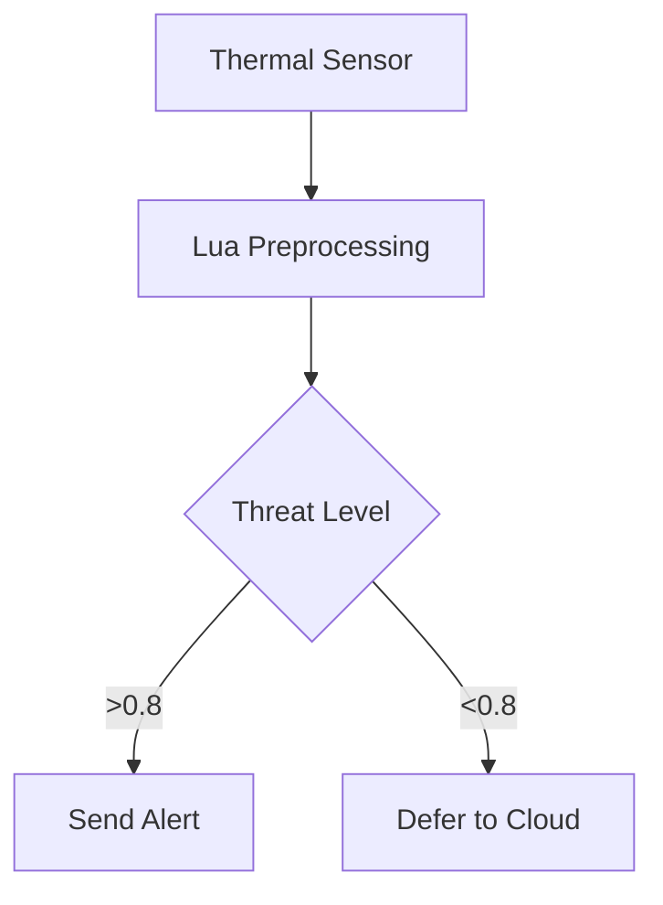

# 🚀 Getting Started with Lua

<p align="center">
  
</p>

---

## 🧩 What is Lua?

**Lua** is a fast, lightweight, and embeddable scripting language designed for extensibility and performance. Originally developed in Brazil, it powers systems where minimal overhead and flexibility are essential.

### Common Applications:
- 🎮 **Game engines** — Roblox, WoW, CryEngine  
- 🌐 **Web infrastructure** — OpenResty (NGINX), Redis scripting  
- 🤖 **Edge AI & robotics** — IoT control, inference pipelines  
- 🔌 **Embedded systems** — routers, sensors, firmware scripting

Lua shines when you need **speed**, **simplicity**, and **seamless C integration** in tight environments.

---

## 📖 What You'll Learn

This course follows a **project-based mastery track** — guiding you from syntax to systems integration through real-world Lua applications.

```mermaid
graph LR
  A[🎮 Game Dev] --> B[🔌 Embedded Systems]
  B --> C[🤖 AI Orchestration]
  C --> D[☁️ Cloud Infrastructure]
````

### 🧠 Learning Outcomes:

* Write efficient Lua code for constrained environments
* Design high-performance Lua/C integrations
* Build AI behaviors for games and simulations
* Develop edge computing and embedded automation tools
* Create production-ready Lua tooling and modules

---

## 🌟 Why Learn Lua in 2025?

### A Modern Language for High-Impact Systems

| Domain           | Key Applications               | Industry Impact                  |
| ---------------- | ------------------------------ | -------------------------------- |
| 🎮 **Game AI**   | NPC scripting, adaptive logic  | Powers 70% of commercial engines |
| ⚡ **Edge AI**    | Local inference, sensor fusion | Embedded in Redis, IoT hubs      |
| 🤖 **Hybrid AI** | C++, LLM, Lua pipelines        | Lua as orchestration layer       |
| 💼 **Careers**   | Embedded Dev, AI Scripter      | \$110K–\$190K average salary     |

### Example Integrations

**🎮 Adaptive AI Behavior**

```lua
function enemy:update()
  local threat = aiPredictThreat(player)
  if threat > 0.7 then self:retreat() else self:attack() end
end
```

**🌐 Edge AI Orchestration**



---

## 📚 Skill Progression Path

### 👶 Beginner (2–4 weeks): Core Foundations

```lua
function c_to_f(c)
  return (c * 9/5) + 32
end
```

**Key Topics:**

* Variables, types (`nil`, `boolean`, `number`, `string`)
* Control flow: `if`, `for`, `while`, `repeat-until`
* Functions, scope, local/global separation
* Tables: arrays, dictionaries, `ipairs`, `pairs`
* File I/O and standard libraries

**Projects:**

* Text-based adventure
* File renamer utility
* Rock-paper-scissors AI
* Inventory manager
* Roblox/LÖVE2D mini-mods
* Simple NPC patrol logic

---

### 👨‍💻 Intermediate (8–12 weeks): Modular Design

```lua
Character = {health = 100}
function Character:new(o)
  return setmetatable(o or {}, {__index = self})
end
```

**Key Topics:**

* Object orientation with metatables (`__index`, `__add`, etc.)
* Error handling with `pcall`, `xpcall`, and defensive code
* Modular programming: creating and requiring modules
* Coroutines and cooperative multitasking
* JSON/XML serialization and config handling

**Projects:**

* RESTful API client
* Download manager with coroutines
* Plugin-based app
* AI state machine
* Sensor preprocessor
* Dialogue system
* Math utility library

---

### 🧠 Advanced (4–6 months): Integration & Optimization

```c
int lua_add(lua_State *L) {
  int a = lua_tonumber(L, 1);
  int b = lua_tonumber(L, 2);
  lua_pushnumber(L, a + b);
  return 1;
}
```

**Key Topics:**

* Lua C API and C binding
* LuaJIT FFI and JIT tuning
* Threading models: Lanes, LuaSocket, event loops
* Performance profiling and garbage collection
* Debugging Lua VM internals and hooks

**Projects:**

* Custom Redis module
* Game engine AI plugin
* Lua-accelerated image processor
* Real-time emotion detection tool
* Physics engine in C with Lua scripting
* IoT controller orchestrated with Lua

---

### 🧬 Expert (1–2 years): Systems Mastery

**Key Topics:**

* Bytecode engineering and Lua VM customization
* Secure sandboxing and Lua execution environments
* OpenResty microservices, Kubernetes orchestration
* DSLs and transpilers (Lua → C, WASM, etc.)
* Open source leadership: LuaRocks, LuaJIT, VM patches

**Projects:**

* Lua → WASM compiler
* Federated LLM orchestrator
* K8s API gateway in Lua
* Custom DSL for network protocols
* Auto-scaling server farm logic
* LuaJIT-powered game AI engine

---

## 💼 Career Tracks

| Track        | Tech Stack       | Entry Role        | Growth Role                |
| ------------ | ---------------- | ----------------- | -------------------------- |
| 🎮 Game Dev  | Lua + C++/Roblox | AI Scripter       | Game AI Engineer           |
| 🌐 Web/Cloud | OpenResty + Lua  | API Dev           | Cloud Platform Engineer    |
| 🔌 Embedded  | Lua + RTOS       | Firmware Scripter | Embedded Systems Architect |
| 🛠 Dev Tools | LuaJIT + CLI     | Tooling Engineer  | DevOps Experience Lead     |

**In-demand skills:** LuaJIT, C integration, async orchestration, system design, AI scripting

---

## ⏱ Roadmap Timeline


---

## 💡 Tips for Success

1. **Choose a domain early** — game dev, embedded, or infra
2. **Practice integrations** — Lua ↔ C++, LLMs, Redis, APIs
3. **Build in public** — share projects, write blog posts
4. **Profile everything** — optimize using LuaJIT and luatrace
5. **Learn the internals** — VM, GC, metatables, bytecode

> *“Lua does more with less — a small language with system-level superpowers.”*
> — Roberto Ierusalimschy, Lua's creator

---

## 🔗 Next Steps

* 📘 [Start the Beginner Path]
* ❓ [View the Lua FAQ]
* ⚙️ [Explore the `luaDev` Build System](https://github.com/hetfs/luaDev)

