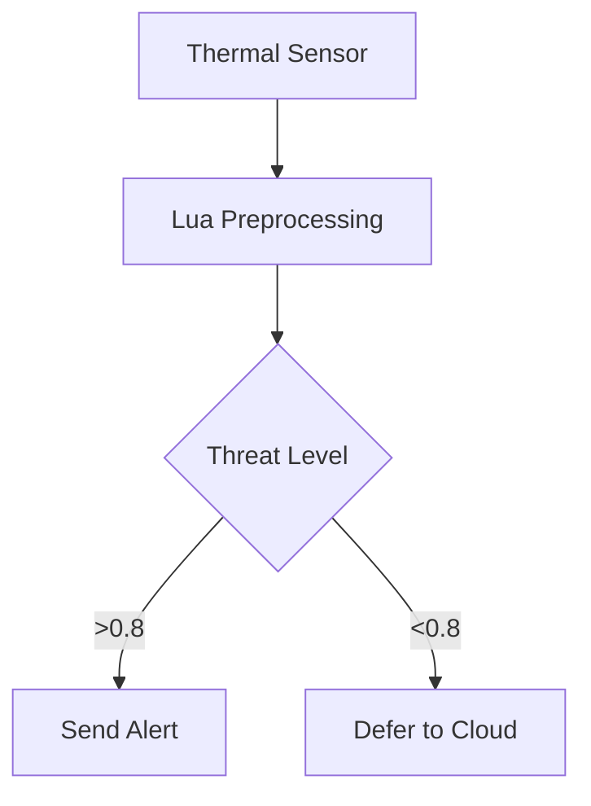

# 🚀 Getting started with Lua

<p align="center">
  
</p>

---

## 🧩 Introducing Lua

**Lua** delivers fast, lightweight, embeddable scripting built for extensibility and performance. Originally developed in Brazil, it supports systems that demand minimal overhead and high flexibility.

## 🧰 Common applications

- 🎮 **Game engines**: Roblox, World of Warcraft, CryEngine  
- 🌐 **Web infrastructure**: OpenResty (NGINX<abbr title="Nginx Is Not eXperimental">†</abbr>), Redis scripting  
- 🤖 **Edge AI and robotics**: IoT control, inference pipelines  
- 🔌 **Embedded systems**: routers, sensors, firmware scripting

Lua performs well in environments that demand speed, simplicity, and seamless C integration.

---

## 📖 What you'll learn

This course follows a **project-based mastery path** guiding learners through Lua fundamentals, systems integration, and practical development.

```mermaid
graph LR
  A[🎮 Game Dev] --> B[🔌 Embedded Systems]
  B --> C[🤖 AI Orchestration]
  C --> D[☁️ Cloud Infrastructure]
````

## 🧠 Learning outcomes

* Write efficient Lua code for limited-resource systems
* Design high-performance Lua and C integrations
* Build AI behaviors for simulations and games
* Develop automation tools for edge and embedded devices
* Create production-level Lua modules and utilities

---

## 🌟 Why learn Lua in 2025

### A modern language for high-impact systems

| Domain       | Key applications                          | Industry impact                   |
| ------------ | ----------------------------------------- | --------------------------------- |
| 🎮 Game AI   | Non-player character scripting            | Used in 70% of commercial engines |
| ⚡ Edge AI    | Local inference, sensor fusion            | Used in Redis and IoT hubs        |
| 🤖 Hybrid AI | C++, large language models, Lua pipelines | Lua used for orchestration        |
| 💼 Careers   | Embedded systems, AI scripting            | \$110K–\$190K average salary      |

### Example integrations

**🎮 Adaptive AI behavior**

```lua
function enemy:update()
  local threat = aiPredictThreat(player)
  if threat > 0.7 then self:retreat() else self:attack() end
end
```

**🌐 Edge AI orchestration**



---

## 📚 Skill progression path

### 👶 Beginner (2–4 weeks): Core foundations

```lua
function c_to_f(c)
  return (c * 9/5) + 32
end
```

**Key topics**

* Variables and types (`nil`, `boolean`, `number`, `string`)
* Control flow: `if`, `for`, `while`, `repeat-until`
* Functions, scoping, and local/global separation
* Tables: arrays, dictionaries, `ipairs`, `pairs`
* File I/O and standard libraries

**Projects**

* Text-based story game
* Batch file renaming utility
* Rock-paper-scissors simulator
* Inventory manager
* Mini games for Roblox or LÖVE2D
* Patrol behavior logic for characters

---

### 👨‍💻 Intermediate (8–12 weeks): Modular design

```lua
Character = {health = 100}
function Character:new(o)
  return setmetatable(o or {}, {__index = self})
end
```

**Key topics**

* Object design with metatables (`__index`, `__add`)
* Error handling using `pcall`, `xpcall`, and fallback logic
* Modular programming with `require`
* coroutines for multitasking
* Configuration handling with JSON and XML

**Projects**

* REST<abbr title="Representational State Transfer">†</abbr> API client
* Download queue with coroutines
* Plugin-based desktop tool
* AI state machine
* Sensor input formatter
* Dialogue controller
* Math utility library

---

### 🧠 Advanced (4–6 months): Integration and optimization

```c
int lua_add(lua_State *L) {
  int a = lua_tonumber(L, 1);
  int b = lua_tonumber(L, 2);
  lua_pushnumber(L, a + b);
  return 1;
}
```

**Key topics**

* C binding using Lua’s API
* LuaJIT’s foreign function interface (FFI<abbr title="Foreign Function Interface">†</abbr>)
* Async<abbr title="Asynchronous">†</abbr> event models with Lanes, LuaSocket, and loops
* Memory management and performance profiling
* Debugging the Lua VM and custom C hooks

**Projects**

* Redis module with Lua hooks
* AI plugin for game engines
* Lua-powered image transformer
* Emotion detection with real-time inference
* Physics engine in C with Lua scripting
* IoT dashboard built with Lua

---

### 🧬 Expert (1–2 years): Systems mastery

**Key topics**

* Bytecode engineering and Lua VM patching
* Secure Sandboxing<abbr title="Sandboxing (code isolation)">†</abbr> techniques
* Kubernetes-based OpenResty microservices
* DSL<abbr title="Domain-Specific Language">†</abbr> design and compiler generation
* Source-to-source transpilation<abbr title="Transpilation (code transformation)">†</abbr> (Lua → C, WASM<abbr title="WebAssembly">†</abbr>)
* LuaRocks and LuaJIT ecosystem contributions

**Projects**

* Lua-to-WASM compiler
* Orchestrator for large language models
* Kubernetes API gateway with Lua
* DSL-driven protocol interface
* Autoscaling<abbr title="Autoscaling (dynamic resource adjustment)">†</abbr> system services
* LuaJIT-powered AI game engine

---

## 💼 Career tracks

| Track        | Tech stack                                                  | Entry role          | Growth path                  |
| ------------ | ----------------------------------------------------------- | ------------------- | ---------------------------- |
| 🎮 Game Dev  | Lua + C++/Roblox                                            | AI scripting intern | Game AI engineer             |
| 🌐 Web/Cloud | Lua + OpenResty                                             | API developer       | Cloud infrastructure lead    |
| 🔌 Embedded  | Lua + RTOS<abbr title="Real-Time Operating System">†</abbr> | Firmware engineer   | Embedded systems architect   |
| 🛠 Dev Tools | LuaJIT + CLI                                                | Automation engineer | Developer experience manager |

**High-value skills**: LuaJIT, C interop<abbr title="Interop (interoperability)">†</abbr>, concurrency models, system design, orchestration

---

## ⏱ Roadmap timeline


---

## 💡 Tips for success

1. Choose a domain that aligns with your goals: games, embedded, or infrastructure
2. Practice Lua–C interop—connect with Redis, APIs, LLMs, or hardware APIs
3. Share your learning—write blogs, publish code, build in public
4. Benchmark frequently—profile and optimize using LuaJIT and LuaTrace
5. Understand Lua internals—VM, GC, metatables, and bytecode mechanics

> *“Lua does more with less—a small language with system-level superpowers.”*
> — Roberto Ierusalimschy, creator of Lua

---

## 🔗 Next steps

* 📘 \[Start the beginner path]
* ❓ \[View the Lua FAQ]
* ⚙️ [Explore the `luaDev` build system](https://github.com/hetfs/luaDev)
